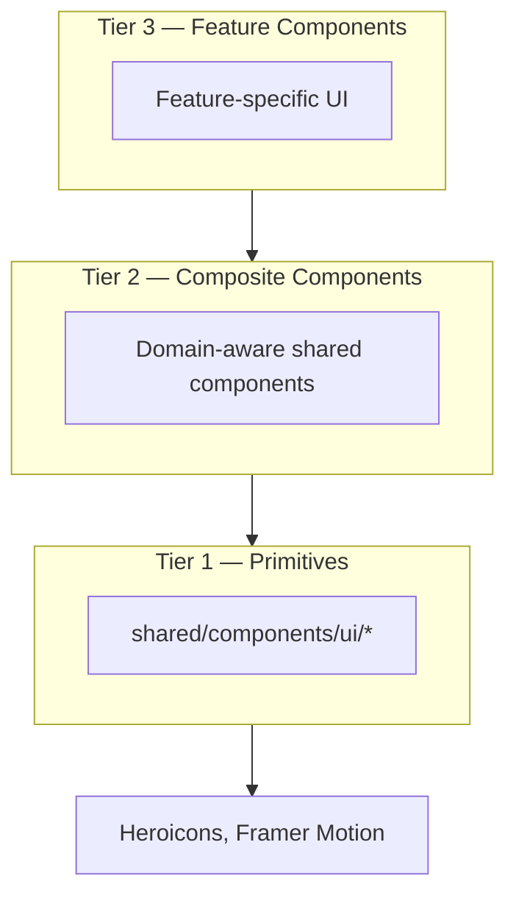

# Component Guidelines — Sports Tipster Platform

> Standards for building consistent, maintainable React components across three tiers.

## 1. Component Tiers



| Tier | Location | Knows about domain? | Examples |
|------|----------|---------------------|----------|
| **1 — Primitive** | `shared/components/ui/` | No | Button, Input, Card, Badge, Modal |
| **2 — Composite** | `shared/components/` | Yes (cross-feature) | OddsCell, BetCard, MatchRow, StatCard |
| **3 — Feature** | `features/*/components/` | Yes (single feature) | LeagueFilter, BetSlipDrawer, ProfileHeader |

### Tier Rules

1. **Primitives** never import from `features/`.
2. **Composites** may use domain types from `core/constants` but not feature services.
3. **Feature components** may use composites, primitives, and feature hooks.
4. Promote component to Tier 2 when used by **2+ features**.

---

## 2. File Structure

```typescript
// shared/components/ui/Button.tsx

import { forwardRef } from 'react'
import { cn } from '@/shared/utils/cn'

export interface ButtonProps extends React.ButtonHTMLAttributes<HTMLButtonElement> {
  variant?: 'primary' | 'secondary' | 'ghost' | 'danger'
  size?: 'sm' | 'md' | 'lg'
  isLoading?: boolean
}

export const Button = forwardRef<HTMLButtonElement, ButtonProps>(
  ({ className, variant = 'primary', size = 'md', isLoading, children, disabled, ...props }, ref) => {
    return (
      <button
        ref={ref}
        className={cn(buttonVariants({ variant, size }), className)}
        disabled={disabled || isLoading}
        {...props}
      >
        {isLoading ? <Spinner /> : children}
      </button>
    )
  },
)

Button.displayName = 'Button'
```

### Conventions

- One exported component per file (primary export)
- Co-locate tiny sub-components (e.g., `Spinner`) in same file if not reused
- `displayName` required for all `forwardRef` components
- Props interface named `{Component}Props`

---

## 3. Props Patterns

### 3.1 Extend Native Elements

Primitives extend native HTML attributes:

```typescript
interface InputProps extends React.InputHTMLAttributes<HTMLInputElement> {
  label?: string
  error?: string
}
```

### 3.2 Variant Props

Use explicit string unions — not boolean prop explosion:

```typescript
// Good
variant: 'primary' | 'secondary' | 'ghost' | 'danger'

// Avoid
primary?: boolean
secondary?: boolean
```

Optional: lightweight `cva` (class-variance-authority) for variant class maps. Not required if `cn()` helper suffices.

### 3.3 Composition over Configuration

Prefer compound components for complex UI:

```typescript
<Card>
  <Card.Header>
    <Card.Title>Active Bets</Card.Title>
    <Card.Action><Link to="...">View all</Link></Card.Action>
  </Card.Header>
  <Card.Body>{children}</Card.Body>
</Card>
```

### 3.4 Render Props & Slots

Use `children` and optional slot props:

```typescript
interface PageShellProps {
  title: string
  description?: string
  actions?: React.ReactNode   // slot for header buttons
  children: React.ReactNode
}
```

### 3.5 Data + Presentation Split

Separate data fetching from presentation:

```typescript
// Container (page or feature hook)
function ActiveBetsPage() {
  const { data, isLoading } = useActiveBets()
  return <ActiveBetsList bets={data} isLoading={isLoading} />
}

// Presentation (feature component)
interface ActiveBetsListProps {
  bets?: BetDto[]
  isLoading: boolean
}
function ActiveBetsList({ bets, isLoading }: ActiveBetsListProps) { ... }
```

---

## 4. Primitive Components (Tier 1)

### Required Primitives (Phase 1)

| Component | Key props | Notes |
|-----------|-----------|-------|
| `Button` | variant, size, isLoading | forwardRef |
| `Input` | label, error | forwardRef |
| `Textarea` | label, error | forwardRef |
| `Select` | options, label, error | Accessible listbox |
| `Checkbox` | label | |
| `Label` | htmlFor | |
| `FieldError` | message | `role="alert"` |
| `Card` | variant | Compound subcomponents |
| `Badge` | variant, size | |
| `Modal` | open, onClose, title | Focus trap |
| `Drawer` | open, onClose, side | Bottom on mobile |
| `Tabs` | value, onChange | |
| `Skeleton` | width, height | |
| `Spinner` | size | |
| `Avatar` | src, fallback, size | |
| `Toast` | via provider | |

### Primitive Checklist

- [ ] Supports `className` override via `cn()`
- [ ] Forwards ref where applicable
- [ ] Has visible focus state
- [ ] Disabled state styled and functional
- [ ] Accepts standard HTML attributes via spread

---

## 5. Composite Components (Tier 2)

### Domain Composites

| Component | Props | Used in |
|-----------|-------|---------|
| `OddsCell` | odds, marketType, selected, onSelect | Fixtures, match detail |
| `MatchRow` | fixture, onClick | Fixtures list |
| `BetCard` | bet, variant: 'active' \| 'history' \| 'compact' | Bets, profile, dashboard |
| `StatCard` | label, value, trend?, icon? | Dashboard, profile |
| `RankingRow` | rank, player, metrics, onClick | Leaderboard |
| `EmptyState` | icon, title, description, action? | All list pages |
| `QueryErrorFallback` | error, onRetry | Query error boundaries |
| `LiveBadge` | — | Match rows, detail |
| `PageShell` | title, description, actions | All pages |

### Composite Example

```typescript
interface OddsCellProps {
  odds: number
  marketType: MarketType
  label: string
  selected?: boolean
  disabled?: boolean
  onSelect?: () => void
}

export function OddsCell({ odds, marketType, label, selected, disabled, onSelect }: OddsCellProps) {
  return (
    <button
      type="button"
      onClick={onSelect}
      disabled={disabled}
      aria-pressed={selected}
      className={cn(
        'font-mono text-sm px-3 py-2 rounded-md border transition-colors',
        selected ? 'border-accent-primary bg-accent-primary/10' : 'border-border-default hover:bg-bg-hover',
        disabled && 'opacity-50 cursor-not-allowed',
      )}
    >
      <span className="block text-xs text-text-muted">{label}</span>
      <span className="block font-bold">{formatOdds(odds, marketType)}</span>
    </button>
  )
}
```

---

## 6. Feature Components (Tier 3)

Examples by feature:

| Feature | Components |
|---------|------------|
| fixtures | `LeagueFilter`, `MatchCard`, `OddsTable`, `MarketTabs` |
| betting | `BetSlipDrawer`, `StakeInput`, `RuleViolationAlert`, `ConfirmBetModal` |
| bets | `CancelBetModal`, `BetHistoryFilters`, `BetStatusBadge` |
| leaderboard | `LeaderboardFilters`, `PlayerSearch`, `RankBadge` |
| profile | `ProfileHeader`, `PerformanceCharts`, `AchievementBadges` |
| seasons | `SeasonCard`, `PrizeTierList`, `SeasonTimeline` |

Feature components **may** call feature hooks directly when they are page-specific sections. Shared sections within a feature should still accept props for testability.

---

## 7. Styling Conventions

### 7.1 Tailwind Usage

- Use design token classes from `UI_DESIGN_SYSTEM.md`
- Order: layout → spacing → typography → color → border → effects
- Use `cn()` for conditional classes

```typescript
import { cn } from '@/shared/utils/cn'

cn('base-classes', condition && 'conditional-class', className)
```

### 7.2 No Inline Styles

Except for dynamic values (chart dimensions, progress width):

```typescript
// Acceptable
style={{ width: `${progress}%` }}

// Avoid
style={{ color: '#00C853' }}  // use Tailwind token instead
```

### 7.3 Responsive Classes

Mobile-first — base styles for mobile, breakpoint overrides:

```typescript
className="grid grid-cols-1 md:grid-cols-2 lg:grid-cols-4 gap-4"
```

---

## 8. Accessibility Requirements

| Requirement | Implementation |
|-------------|----------------|
| Interactive elements | Native `<button>` or `<a>`; avoid `<div onClick>` |
| Icon-only buttons | `aria-label` required |
| Loading buttons | `aria-busy="true"`, disable interaction |
| Modals | Focus trap, `aria-modal`, Escape to close |
| Live updates | `aria-live="polite"` on toast container |
| Forms | `<label htmlFor>` + `id` on input |

---

## 9. Animation Guidelines

| Component type | Animation |
|----------------|-----------|
| Page transitions | Framer Motion fade (200ms) |
| Drawer / Modal | Framer Motion slide/fade |
| List items | Optional stagger on first load only |
| Odds cells | CSS hover only |
| Buttons | CSS active scale |

Always check `prefers-reduced-motion` (see `UI_DESIGN_SYSTEM.md`).

---

## 10. Error & Empty States

Every list/table component must handle three states:

```typescript
if (isLoading) return <Skeleton ... />
if (error) return <QueryErrorFallback error={error} onRetry={refetch} />
if (!data?.length) return <EmptyState title="No active bets" ... />
return <List items={data} />
```

Use feature-specific `EmptyState` messages — not generic "No data".

---

## 11. Icons

```typescript
import { HomeIcon } from '@heroicons/react/24/outline'
import { HomeIcon as HomeIconSolid } from '@heroicons/react/24/solid'
```

- Nav: outline 24px
- Active nav item: solid 24px
- Inline: solid 20px with `shrink-0`

---

## 12. TypeScript Standards

- `strict: true` — no `any`
- Props interface exported for public components
- Use `type` imports: `import type { BetDto } from '...'`
- Discriminated unions for variant-specific props:

```typescript
type BetCardProps =
  | { variant: 'active'; bet: ActiveBetDto; onCancel: () => void }
  | { variant: 'history'; bet: HistoryBetDto }
  | { variant: 'compact'; bet: BetSummaryDto }
```

---

## 13. Testing Components

| Tier | Test focus |
|------|------------|
| Primitive | Renders, variants, accessibility, ref forwarding |
| Composite | User interactions, formatting output |
| Feature | Integration with MSW + Query (higher level) |

```typescript
// Example: OddsCell test
it('calls onSelect when clicked', async () => {
  const onSelect = vi.fn()
  render(<OddsCell odds={1.95} marketType="handicap" label="Home -0.5" onSelect={onSelect} />)
  await userEvent.click(screen.getByRole('button'))
  expect(onSelect).toHaveBeenCalledOnce()
})
```

---

## 14. Storybook Policy (Optional)

If Storybook is added later:

- Tier 1 and Tier 2 components require stories for all variants
- Tier 3 stories optional — page-level tests preferred
- MSW decorators for data-dependent composites

---

## 15. Anti-Patterns

| Anti-pattern | Correct approach |
|--------------|------------------|
| Fetching data in primitives | Pass data via props |
| Importing feature A from feature B | Promote to shared |
| Storing API data in component state | Use TanStack Query |
| 500-line page components | Split into feature components |
| Hardcoded colors | Use design tokens |
| Missing loading states | Skeleton matching layout |

---

## 16. Related Documents

- `UI_DESIGN_SYSTEM.md` — Visual tokens and component catalog
- `FOLDER_STRUCTURE.md` — File locations by tier
- `STATE_MANAGEMENT_PLAN.md` — Hook patterns for data components
