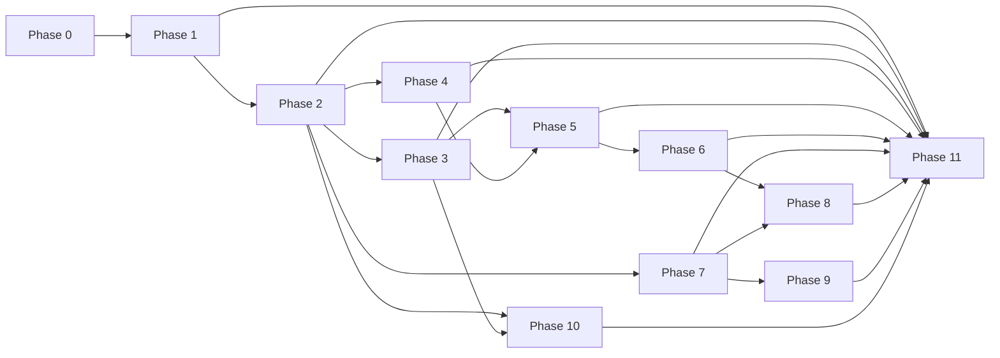

# Development Roadmap — Sports Tipster Platform

> Phased implementation plan for the React 19 frontend (football MVP). Each phase builds on prior phases and ends with testable acceptance criteria.

## Dependency Graph

---

## Phase 0 — Planning Documentation & Project Scaffold

### Objective

Establish conventions, tooling, and architecture documentation before feature development.

### Deliverables

- [x] Eight planning documents in `docs/`
- [x] Vite + React 19 + TypeScript (strict) project
- [x] Tailwind CSS 4 via `@tailwindcss/vite`
- [x] Path alias `@/` → `src/`
- [x] ESLint + Prettier configuration
- [x] Core layer: `env`, `routes`, `markets`, `bettingRules`, `api/client`, `api/types`
- [ ] MSW bootstrap wired in `providers.tsx` (Phase 2)

### Pages

None — scaffold only.

### Components

None — remove Vite starter template in Phase 1.

### Dependencies

None.

### Complexity

**Low**

### Acceptance Criteria

- [ ] `npm run dev` starts on port 5173 without errors
- [ ] `npm run build` completes with zero TypeScript errors
- [ ] `npm run lint` passes
- [ ] All 8 docs present in `docs/`
- [ ] `src/core/` constants match route table and betting rules
- [ ] `.env.example` documents `VITE_API_URL` and `VITE_ENABLE_MSW`

---

## Phase 1 — Design System & App Shell

### Objective

Build production UI foundation, theme tokens, and responsive navigation shell with placeholder pages.

### Deliverables

- Design token CSS (`src/app/styles/theme.css`)
- All Tier 1 UI primitives
- `MainLayout`, `AuthLayout`, `MinimalLayout`
- Router skeleton with lazy route placeholders
- `NotFoundPage` (404)
- Replace Vite starter `App.tsx` with provider + router setup

### Pages (Placeholders)

All routes from `ROUTING_PLAN.md` render placeholder content.

### Components

| Component | Tier |
|-----------|------|
| Button, Input, Textarea, Select, Checkbox, Label, FieldError | 1 |
| Card (compound), Badge, Modal, Drawer, Tabs | 1 |
| Skeleton, Spinner, Avatar, Toast provider | 1 |
| Header, Sidebar, BottomNav, PageShell | Layout |
| EmptyState | 2 |

### Dependencies

Phase 0.

### Complexity

**Medium**

### Acceptance Criteria

- [ ] Dark theme applied globally (`#0B0F14` background, `#141A22` surfaces, `#00C853` accent)
- [ ] Inter + JetBrains Mono fonts loaded
- [ ] Mobile: bottom navigation visible; desktop (`lg+`): sidebar visible
- [ ] Navigation between all placeholder routes works
- [ ] 404 page renders for unknown paths
- [ ] All primitives render variants correctly in isolation
- [ ] Focus rings visible on interactive elements

---

## Phase 2 — API Layer, MSW & Auth

### Objective

Backend-ready data layer with mocked authentication and route guards.

### Deliverables

- TanStack Query `QueryClient` with defaults
- MSW worker + auth handlers
- `authStore` with session persistence
- `ProtectedRoute` and `GuestRoute`
- Auth service + query hooks
- Zod schemas for auth forms

### Pages

| Route | Page |
|-------|------|
| `/auth/login` | LoginPage |
| `/auth/register` | RegisterPage |
| `/auth/forgot-password` | ForgotPasswordPage |
| `/auth/reset-password` | ResetPasswordPage |

### Components

- `AuthFormLayout`
- `PasswordField`
- `FormErrorSummary`

### Dependencies

Phase 1.

### Complexity

**Medium**

### Acceptance Criteria

- [ ] MSW intercepts auth endpoints in dev (`VITE_ENABLE_MSW=true`)
- [ ] Register → auto-login → redirect to dashboard
- [ ] Login with invalid credentials shows API error message
- [ ] Session persists across browser refresh (`sessionStorage`)
- [ ] Protected routes redirect unauthenticated users to login with `?redirect=`
- [ ] Guest routes redirect authenticated users to dashboard
- [ ] Logout clears session and Query cache
- [ ] 401 from API triggers logout and redirect

---

## Phase 3 — Dashboard & Wallet

### Objective

User home surface and virtual credit visibility.

### Deliverables

- Dashboard with summary widgets
- Wallet page with transaction history
- MSW handlers for wallet endpoints
- Wallet query hooks + key factory

### Pages

| Route | Page |
|-------|------|
| `/` | DashboardPage |
| `/wallet` | WalletPage |

### Components

- `BalanceCard`
- `QuickStats` (active bets, rank, win rate)
- `RecentActivityList`
- `CreditTransactionRow`

### Dependencies

Phase 2.

### Complexity

**Medium**

### Acceptance Criteria

- [ ] Dashboard displays virtual balance from API
- [ ] Dashboard shows rank snapshot and active bet count
- [ ] Quick links navigate to fixtures, active bets, leaderboard
- [ ] Wallet page lists transactions with type, amount, date
- [ ] Initial balance shows 10,000 credits for new users
- [ ] Loading skeletons match card layout
- [ ] Empty transaction state handled gracefully

---

## Phase 4 — Fixtures Module

### Objective

Browse football matches and view detailed odds across all market types.

### Deliverables

- Fixtures list with league and status filters
- Match detail page with Malay, Handicap, Over/Under markets
- MSW fixtures handlers + seed data
- Odds formatting utilities

### Pages

| Route | Page |
|-------|------|
| `/fixtures` | FixturesPage |
| `/fixtures/:matchId` | MatchDetailPage |

### Components

- `LeagueFilter`
- `MatchRow`, `MatchCard`
- `OddsTable`, `OddsCell`
- `LiveBadge`, `MarketTabs`
- `MatchHeader` (teams, score, time)

### Dependencies

Phase 1, Phase 2.

### Complexity

**High**

### Acceptance Criteria

- [ ] Fixtures list displays football matches grouped or filtered by league
- [ ] Filter by league and match status via URL search params
- [ ] Live matches show red live badge
- [ ] Match detail displays all three market types with formatted odds
- [ ] Suspended selections are disabled with visual indicator
- [ ] Clicking odds adds selection to bet slip (Phase 5 integration point)
- [ ] Mobile: card list; desktop: table or dense list
- [ ] Loading and empty states implemented

---

## Phase 5 — Betting & Bet Slip

### Objective

Core virtual betting experience with business rule enforcement.

### Deliverables

- `betSlipStore` with selection management
- Bet slip page + drawer/sheet overlay
- Stake input with small/big bet validation
- Daily big bet limit display
- Place bet mutation with MSW handler

### Pages

| Route | Page |
|-------|------|
| `/bet-slip` | BetSlipPage |

Plus drawer accessible from fixtures/match detail.

### Components

- `BetSlipDrawer`
- `StakeInput`
- `BetTypeIndicator` (small/big)
- `RuleViolationAlert`
- `ConfirmBetModal`
- `PotentialReturnDisplay`

### Dependencies

Phase 3, Phase 4.

### Complexity

**High**

### Acceptance Criteria

- [ ] Selection from fixture appears in bet slip with match and odds info
- [ ] Stake validation enforces 1–500 (small) or 501–2,000 (big)
- [ ] Invalid stake (e.g., 750 is invalid... wait, 501-2000 is big, 750 is valid big bet) — invalid e.g., 2500 shows error
- [ ] Daily big bet counter shows usage (e.g., "2 of 3 big bets today")
- [ ] Placing bet deducts stake from wallet balance
- [ ] Placing bet adds entry to active bets
- [ ] Bet slip clears on successful placement
- [ ] Insufficient balance shows `INSUFFICIENT_BALANCE` error
- [ ] Confirmation modal before placing big bets (optional UX enhancement)

---

## Phase 6 — Active Bets & History

### Objective

Complete bet lifecycle management including cancellation with penalty.

### Deliverables

- Active bets list with cancel flow
- Bet history with filters
- Cancel bet mutation with penalty preview

### Pages

| Route | Page |
|-------|------|
| `/bets/active` | ActiveBetsPage |
| `/bets/history` | BetHistoryPage |

### Components

- `BetCard` (active and history variants)
- `CancelBetModal` with penalty calculation
- `BetStatusBadge`
- `BetHistoryFilters`

### Dependencies

Phase 5.

### Complexity

**Medium**

### Acceptance Criteria

- [ ] Active bets list shows all unsettled bets with stake, odds, potential return
- [ ] Cancel bet shows 10% penalty preview before confirmation
- [ ] After cancel: penalty deducted, remainder refunded, bet moves to history
- [ ] History supports filter by status and date range
- [ ] Empty states for no active bets and no history
- [ ] Bet status badges use semantic colors (won=green, lost=red)

---

## Phase 7 — Leaderboard

### Objective

Competition rankings with search, sort, and player discovery.

### Deliverables

- Leaderboard page with sortable rankings
- Player search
- Top 3 visual treatment
- MSW leaderboard handler

### Pages

| Route | Page |
|-------|------|
| `/leaderboard` | LeaderboardPage |

### Components

- `RankingTable`, `RankingRow`
- `PlayerSearch`
- `LeaderboardFilters`
- `RankBadge` (gold/silver/bronze for top 3)
- `FormStreak` (W/L indicators)

### Dependencies

Phase 2.

### Complexity

**Medium**

### Acceptance Criteria

- [ ] Rankings display points, ROI, win rate, P/L, form
- [ ] Sort by points, ROI, or form via URL param
- [ ] Search filters players by username
- [ ] Current user's rank highlighted
- [ ] Top 3 rows have gold/silver/bronze styling
- [ ] Clicking row navigates to `/players/:userId`
- [ ] Mobile: card list; desktop: full table

---

## Phase 8 — Public Transparency Profile

### Objective

Tipster evaluation surface with comprehensive stats and charts.

### Deliverables

- Public profile page for any user
- Performance charts (Recharts)
- Public bet history (read-only)
- Achievement badges

### Pages

| Route | Page |
|-------|------|
| `/players/:userId` | PublicProfilePage |

### Components

- `ProfileHeader`
- `SeasonStatsGrid`
- `PerformanceCharts` (P/L over time, form)
- `LeaguePerformanceChart`
- `FormStreak`
- `AchievementBadges`
- `PublicBetHistory`

### Dependencies

Phase 6, Phase 7.

### Complexity

**High**

### Acceptance Criteria

- [ ] Profile shows username, avatar, rank, member since
- [ ] Season stats grid: points, ROI, win rate, P/L, total bets
- [ ] At least 2 charts render with themed colors
- [ ] League performance breakdown visible
- [ ] Recent form streak (last 5 results)
- [ ] Public bet history paginated and read-only
- [ ] Links from leaderboard open correct profile
- [ ] Charts responsive on mobile

---

## Phase 9 — Seasons

### Objective

Season context, prize information, and historical seasons.

### Deliverables

- Seasons overview page
- Season detail with prize tiers
- MSW seasons handlers

### Pages

| Route | Page |
|-------|------|
| `/seasons` | SeasonsPage |
| `/seasons/:seasonId` | SeasonDetailPage |

### Components

- `SeasonCard`
- `PrizeTierList`
- `SeasonTimeline`
- `PrizeBadge`

### Dependencies

Phase 7.

### Complexity

**Low–Medium**

### Acceptance Criteria

- [ ] Current active season highlighted on overview
- [ ] Past seasons listed with date range and status
- [ ] Season detail shows prize tiers with rank ranges
- [ ] Top 10 rankings snapshot on season detail
- [ ] Navigate from overview to detail and back

---

## Phase 10 — Notifications, Profile Edit & Settings

### Objective

User engagement and account management surfaces.

### Deliverables

- Notification feed with mark-as-read
- Profile edit form
- Settings page with preferences
- Header notification bell with unread count

### Pages

| Route | Page |
|-------|------|
| `/notifications` | NotificationsPage |
| `/profile/edit` | EditProfilePage |
| `/settings` | SettingsPage |

### Components

- `NotificationList`, `NotificationItem`
- `ProfileForm`
- `SettingsSection`
- `NotificationBell` (in Header)

### Dependencies

Phase 2.

### Complexity

**Medium**

### Acceptance Criteria

- [ ] Notifications list with type icons and timestamps
- [ ] Mark single notification as read
- [ ] Mark all as read action
- [ ] Unread count badge in header updates
- [ ] Profile edit updates username/avatar in header
- [ ] Settings toggles persist via API mock
- [ ] Notification click navigates to relevant page (bet, leaderboard)

---

## Phase 11 — Polish, Accessibility & Performance

### Objective

Production hardening — performance, accessibility, motion polish, and legal page.

### Deliverables

- Route-level code splitting (`React.lazy`)
- Framer Motion page transitions (respect reduced motion)
- Accessibility audit fixes
- Bundle size analysis
- Static Terms of Service page
- Lighthouse optimization pass

### Pages

| Route | Page |
|-------|------|
| `/terms` | TermsPage |

### Components

- Route lazy imports for all feature pages
- `SkipToContent` link in MainLayout
- `prefers-reduced-motion` global handler

### Dependencies

All prior phases (Phase 1–10).

### Complexity

**Medium**

### Acceptance Criteria

- [ ] All feature pages lazy-loaded with Suspense skeletons
- [ ] Lighthouse Performance score ≥ 85 on mobile (simulated)
- [ ] No critical axe accessibility violations
- [ ] `prefers-reduced-motion` disables Framer Motion animations
- [ ] Terms page accessible without authentication
- [ ] No console errors in production build
- [ ] Initial JS bundle ≤ 250KB gzipped (target)
- [ ] Page transitions smooth on desktop; instant on reduced motion

---

## Summary Table

| Phase | Name | Complexity | Key outcome |
|-------|------|------------|-------------|
| 0 | Docs & Scaffold | Low | Foundation |
| 1 | Design System & Shell | Medium | Navigable app shell |
| 2 | API, MSW & Auth | Medium | Login/register works |
| 3 | Dashboard & Wallet | Medium | Balance visible |
| 4 | Fixtures | High | Browse matches + odds |
| 5 | Betting & Bet Slip | High | Place virtual bets |
| 6 | Bets Lifecycle | Medium | Cancel with penalty |
| 7 | Leaderboard | Medium | Rankings + search |
| 8 | Public Profile | High | Tipster transparency |
| 9 | Seasons | Low–Medium | Prizes + history |
| 10 | Notifications & Settings | Medium | User management |
| 11 | Polish & A11y | Medium | Production-ready |

---

## Out of Scope (Entire Frontend Phase)

- Node.js / Fastify backend
- PostgreSQL / Prisma / Redis
- React Native mobile app
- Admin dashboard
- Real push notifications (UI hooks only)
- Real email delivery
- Real sports odds API integration
- Payment processing
- Multi-sport support (architecture ready; football data only)

---

## Post-Frontend: Backend Integration

When backend development begins:

1. Implement REST API per `API_INTEGRATION_PLAN.md`
2. Set `VITE_ENABLE_MSW=false`
3. Add Socket.IO client module
4. Migrate auth to httpOnly cookies
5. No frontend folder restructuring required

---

## Related Documents

| Document | Purpose |
|----------|---------|
| `PROJECT_ARCHITECTURE.md` | System overview |
| `FOLDER_STRUCTURE.md` | File organization |
| `ROUTING_PLAN.md` | Route definitions |
| `STATE_MANAGEMENT_PLAN.md` | Query and store patterns |
| `API_INTEGRATION_PLAN.md` | REST contract |
| `UI_DESIGN_SYSTEM.md` | Visual standards |
| `COMPONENT_GUIDELINES.md` | Component patterns |
