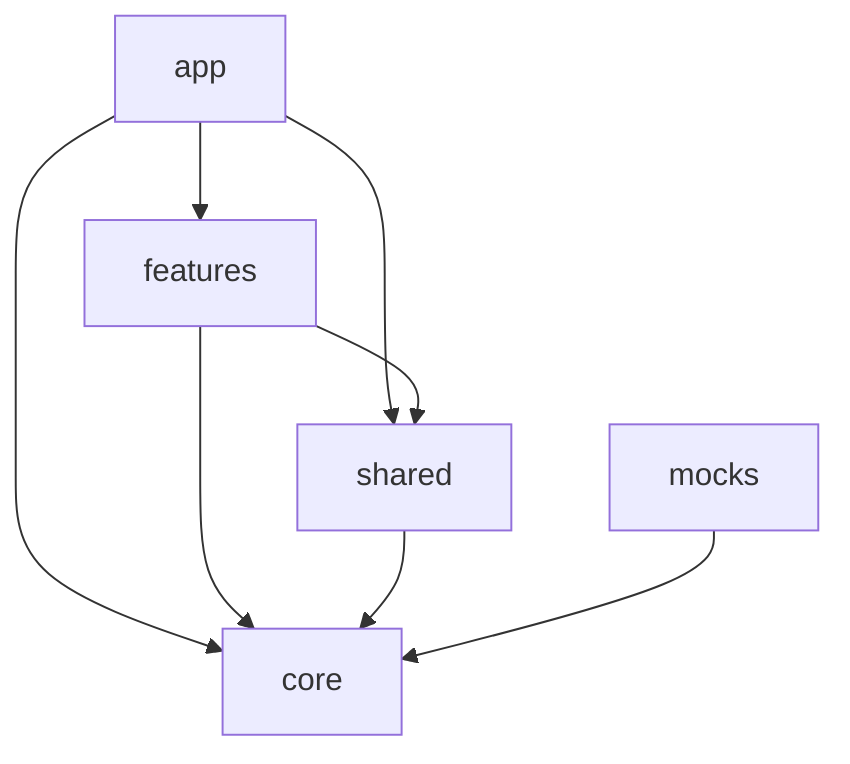

# Folder Structure — Sports Tipster Platform

> Canonical directory layout for the React frontend. Follow this structure when adding files.

## 1. Full Directory Tree

```
Betting-Freelancer/
├── docs/                              # Architecture and planning documents
├── public/
│   ├── favicon.ico
│   └── icons/                         # Static SVG assets
├── src/
│   ├── app/
│   │   ├── App.tsx                    # Root component
│   │   ├── providers.tsx              # QueryClient, Router, Theme, Toast, MSW gate
│   │   ├── router.tsx                 # Route definitions, guards, lazy imports
│   │   └── styles/
│   │       ├── theme.css              # CSS custom properties (design tokens)
│   │       └── globals.css            # Base resets, font imports
│   ├── core/
│   │   ├── api/
│   │   │   ├── client.ts              # Axios instance + interceptors
│   │   │   └── queryClient.ts         # TanStack Query defaults
│   │   ├── config/
│   │   │   ├── env.ts                 # VITE_* environment access
│   │   │   └── bettingRules.ts        # Virtual betting business rules
│   │   ├── constants/
│   │   │   ├── routes.ts              # ROUTES object + path builders
│   │   │   └── markets.ts             # Market types, statuses, enums
│   │   └── types/
│   │       └── api.ts                 # ApiResponse, ApiError, shared envelopes
│   ├── features/
│   │   ├── auth/
│   │   │   ├── api/
│   │   │   │   ├── auth.service.ts
│   │   │   │   └── auth.types.ts
│   │   │   ├── components/
│   │   │   ├── hooks/
│   │   │   ├── pages/
│   │   │   │   ├── LoginPage.tsx
│   │   │   │   ├── RegisterPage.tsx
│   │   │   │   ├── ForgotPasswordPage.tsx
│   │   │   │   └── ResetPasswordPage.tsx
│   │   │   ├── schemas/
│   │   │   │   └── auth.schema.ts
│   │   │   └── stores/
│   │   │       └── authStore.ts
│   │   ├── dashboard/
│   │   │   ├── api/
│   │   │   ├── components/
│   │   │   ├── hooks/
│   │   │   └── pages/
│   │   │       └── DashboardPage.tsx
│   │   ├── wallet/
│   │   │   ├── api/
│   │   │   ├── components/
│   │   │   ├── hooks/
│   │   │   └── pages/
│   │   │       └── WalletPage.tsx
│   │   ├── fixtures/
│   │   │   ├── api/
│   │   │   ├── components/
│   │   │   ├── hooks/
│   │   │   └── pages/
│   │   │       ├── FixturesPage.tsx
│   │   │       └── MatchDetailPage.tsx
│   │   ├── betting/
│   │   │   ├── api/
│   │   │   ├── components/
│   │   │   ├── hooks/
│   │   │   ├── pages/
│   │   │   │   └── BetSlipPage.tsx
│   │   │   ├── schemas/
│   │   │   └── stores/
│   │   │       └── betSlipStore.ts
│   │   ├── bets/
│   │   │   ├── api/
│   │   │   ├── components/
│   │   │   ├── hooks/
│   │   │   └── pages/
│   │   │       ├── ActiveBetsPage.tsx
│   │   │       └── BetHistoryPage.tsx
│   │   ├── leaderboard/
│   │   │   ├── api/
│   │   │   ├── components/
│   │   │   ├── hooks/
│   │   │   └── pages/
│   │   │       └── LeaderboardPage.tsx
│   │   ├── profile/
│   │   │   ├── api/
│   │   │   ├── components/
│   │   │   ├── hooks/
│   │   │   └── pages/
│   │   │       ├── PublicProfilePage.tsx
│   │   │       └── EditProfilePage.tsx
│   │   ├── seasons/
│   │   │   ├── api/
│   │   │   ├── components/
│   │   │   ├── hooks/
│   │   │   └── pages/
│   │   │       ├── SeasonsPage.tsx
│   │   │       └── SeasonDetailPage.tsx
│   │   ├── notifications/
│   │   │   ├── api/
│   │   │   ├── components/
│   │   │   ├── hooks/
│   │   │   └── pages/
│   │   │       └── NotificationsPage.tsx
│   │   └── settings/
│   │       ├── api/
│   │       ├── components/
│   │       ├── hooks/
│   │       └── pages/
│   │           ├── SettingsPage.tsx
│   │           └── TermsPage.tsx
│   ├── shared/
│   │   ├── components/
│   │   │   ├── ui/                    # Primitives: Button, Input, Card, etc.
│   │   │   ├── OddsCell.tsx           # Composites shared across features
│   │   │   ├── BetCard.tsx
│   │   │   ├── MatchRow.tsx
│   │   │   ├── StatCard.tsx
│   │   │   ├── RankingRow.tsx
│   │   │   ├── EmptyState.tsx
│   │   │   ├── QueryErrorFallback.tsx
│   │   │   └── PageShell.tsx
│   │   ├── layouts/
│   │   │   ├── MainLayout.tsx
│   │   │   ├── AuthLayout.tsx
│   │   │   ├── MinimalLayout.tsx
│   │   │   ├── Header.tsx
│   │   │   ├── Sidebar.tsx
│   │   │   └── BottomNav.tsx
│   │   ├── hooks/
│   │   │   ├── useMediaQuery.ts
│   │   │   ├── useDebounce.ts
│   │   │   └── useDocumentTitle.ts
│   │   ├── guards/
│   │   │   ├── ProtectedRoute.tsx
│   │   │   └── GuestRoute.tsx
│   │   └── utils/
│   │       ├── formatOdds.ts
│   │       ├── formatCurrency.ts
│   │       ├── formatDate.ts
│   │       └── cn.ts                  # clsx/tailwind-merge helper
│   ├── mocks/
│   │   ├── browser.ts                 # MSW worker bootstrap
│   │   ├── handlers/
│   │   │   ├── index.ts
│   │   │   ├── auth.handlers.ts
│   │   │   ├── fixtures.handlers.ts
│   │   │   ├── bets.handlers.ts
│   │   │   ├── wallet.handlers.ts
│   │   │   ├── leaderboard.handlers.ts
│   │   │   ├── profile.handlers.ts
│   │   │   ├── seasons.handlers.ts
│   │   │   └── notifications.handlers.ts
│   │   └── data/
│   │       ├── users.json
│   │       ├── fixtures.json
│   │       ├── bets.json
│   │       └── seasons.json
│   ├── assets/
│   │   └── logos/
│   ├── main.tsx                       # Entry point
│   └── vite-env.d.ts
├── .env.example
├── index.html
├── package.json
├── tsconfig.json
├── tsconfig.app.json
├── vite.config.ts
├── eslint.config.js
└── .prettierrc
```

---

## 2. Layer Definitions

### 2.1 `app/`

Application bootstrap only. No business logic.

- **`providers.tsx`** — Composes QueryClientProvider, BrowserRouter, theme context, toast provider.
- **`router.tsx`** — Single source of route configuration; imports lazy page components.
- **`styles/`** — Global CSS and design token definitions.

### 2.2 `core/`

Framework-level utilities shared by all features. **No React components** except provider setup in `app/`.

- Stable, rarely changed.
- Imported by features and shared layers.
- Must not import from `features/`.

### 2.3 `features/`

Domain modules. Each feature owns its pages, API services, hooks, and domain-specific components.

**Internal structure (mandatory for every feature):**

```
features/{name}/
├── api/           # Service functions + DTO types
├── components/    # Feature-only UI (not reused elsewhere)
├── hooks/         # TanStack Query wrappers
├── pages/         # Route-level page components
├── schemas/       # Zod schemas (optional, for forms)
└── stores/        # Zustand slices (optional, client-only state)
```

### 2.4 `shared/`

Cross-feature reusable code. Split into:

| Subfolder | Contents |
|-----------|----------|
| `components/ui/` | Design system primitives |
| `components/` | Domain-aware composites (OddsCell, BetCard) |
| `layouts/` | Shell layouts and navigation chrome |
| `hooks/` | Generic React hooks |
| `guards/` | Route guard components |
| `utils/` | Pure functions (formatters, helpers) |

### 2.5 `mocks/`

MSW handlers and seed data. Mirrors `API_INTEGRATION_PLAN.md` endpoint paths exactly.

---

## 3. Naming Conventions

### 3.1 Files

| Type | Pattern | Example |
|------|---------|---------|
| Page | `{Name}Page.tsx` | `FixturesPage.tsx` |
| Component | `PascalCase.tsx` | `MatchRow.tsx` |
| Hook | `use{Name}.ts` | `useFixtures.ts` |
| Store | `{name}Store.ts` | `betSlipStore.ts` |
| Service | `{domain}.service.ts` | `fixtures.service.ts` |
| Types | `{domain}.types.ts` | `fixtures.types.ts` |
| Schema | `{domain}.schema.ts` | `auth.schema.ts` |
| MSW handler | `{domain}.handlers.ts` | `bets.handlers.ts` |
| Query keys | `{domain}Keys.ts` | `fixtureKeys.ts` |

### 3.2 Exports

- **Named exports** for components, hooks, and utilities.
- **Default export** only for page components consumed by lazy router imports.
- One primary component per file; co-locate small sub-components if not reused.

### 3.3 Types and Interfaces

- Suffix DTOs with descriptive names: `FixtureDto`, `PlaceBetPayload`.
- Use `type` for unions and mapped types; `interface` for object shapes intended for extension.
- Enums live in `core/constants/` as `const` objects (not TypeScript `enum` keyword).

---

## 4. Import Rules

### 4.1 Path Alias

Use `@/` alias (configured in `vite.config.ts`):

```typescript
import { ROUTES } from '@/core/constants/routes'
import { Button } from '@/shared/components/ui/Button'
import { useFixtures } from '@/features/fixtures/hooks/useFixtures'
```

**Never use relative imports that traverse more than one directory** (e.g. avoid `../../../`).

### 4.2 Dependency Direction



| From | May import | Must NOT import |
|------|------------|-----------------|
| `app/` | `features/`, `shared/`, `core/` | `mocks/` directly in components |
| `features/{A}/` | `shared/`, `core/` | `features/{B}/` |
| `shared/` | `core/` | `features/` |
| `core/` | External libs only | `features/`, `shared/`, `app/` |
| `mocks/` | `core/` | `features/` |

### 4.3 Cross-Feature Communication

Features **cannot import from other features**. When two features need the same behavior:

1. **Promote to `shared/`** — UI composites, hooks, utils.
2. **Promote to `core/`** — Constants, types, config.
3. **Use TanStack Query cache** — Feature A writes; Feature B reads via shared query keys in `core/` or `shared/`.
4. **Use global Zustand stores in `core/` or `shared/`** — Only for truly global client state (auth, bet slip).

**Example:** `fixtures` adds a selection; `betting` reads `betSlipStore` — both access `@/features/betting/stores/betSlipStore` is **wrong** from fixtures. Instead:

- `betSlipStore` lives in `features/betting/stores/`.
- `fixtures` calls a **shared action** exported from the store file, OR fixtures dispatches via a shared hook `@/shared/hooks/useBetSlipActions.ts` that wraps the store.

Preferred pattern: expose store actions through `shared/hooks/useBetSlipActions.ts` so fixtures never imports betting internals directly.

### 4.4 Barrel Files

- **`shared/components/ui/index.ts`** — Allowed for primitives.
- **Feature barrel files** — Avoid; import directly from source files for tree-shaking clarity.

---

## 5. Feature Module Checklist

When creating a new feature:

- [ ] Create folder under `src/features/{name}/`
- [ ] Add `api/{name}.service.ts` and `{name}.types.ts`
- [ ] Add `hooks/use{Name}.ts` with query key factory
- [ ] Add page(s) under `pages/`
- [ ] Register routes in `app/router.tsx`
- [ ] Add MSW handlers in `mocks/handlers/`
- [ ] Add seed data in `mocks/data/` if needed
- [ ] Document endpoints in `API_INTEGRATION_PLAN.md`

---

## 6. Code Organization Patterns

### 6.1 Service Layer

```typescript
// features/fixtures/api/fixtures.service.ts
import { apiClient } from '@/core/api/client'
import type { FixtureDto } from './fixtures.types'

export async function listFixtures(params?: FixtureListParams) {
  const { data } = await apiClient.get<{ data: FixtureDto[] }>('/fixtures', { params })
  return data.data
}
```

### 6.2 Query Hook

```typescript
// features/fixtures/hooks/useFixtures.ts
import { useQuery } from '@tanstack/react-query'
import { fixtureKeys } from './fixtureKeys'
import { listFixtures } from '../api/fixtures.service'

export function useFixtures(params?: FixtureListParams) {
  return useQuery({
    queryKey: fixtureKeys.list(params),
    queryFn: () => listFixtures(params),
  })
}
```

### 6.3 Page Component

```typescript
// features/fixtures/pages/FixturesPage.tsx
export default function FixturesPage() {
  const { data, isLoading, error } = useFixtures()
  // compose shared + feature components
}
```

---

## 7. Assets

| Location | Usage |
|----------|-------|
| `src/assets/` | Bundled images imported in components |
| `public/` | Static files referenced by URL path |

Team crests and league logos: prefer CDN URLs from API/mock data; local fallbacks in `src/assets/logos/`.

---

## 8. Configuration Files (Root)

| File | Purpose |
|------|---------|
| `vite.config.ts` | `@/` alias, Tailwind plugin, dev server port 5173 |
| `tsconfig.app.json` | Strict TS, path mapping |
| `eslint.config.js` | Lint rules including import order |
| `.prettierrc` | Formatting consistency |
| `.env.example` | Documented env vars |

---

## 9. Related Documents

- `PROJECT_ARCHITECTURE.md` — System overview and data flow
- `COMPONENT_GUIDELINES.md` — Component tier rules
- `ROUTING_PLAN.md` — Route registration conventions
