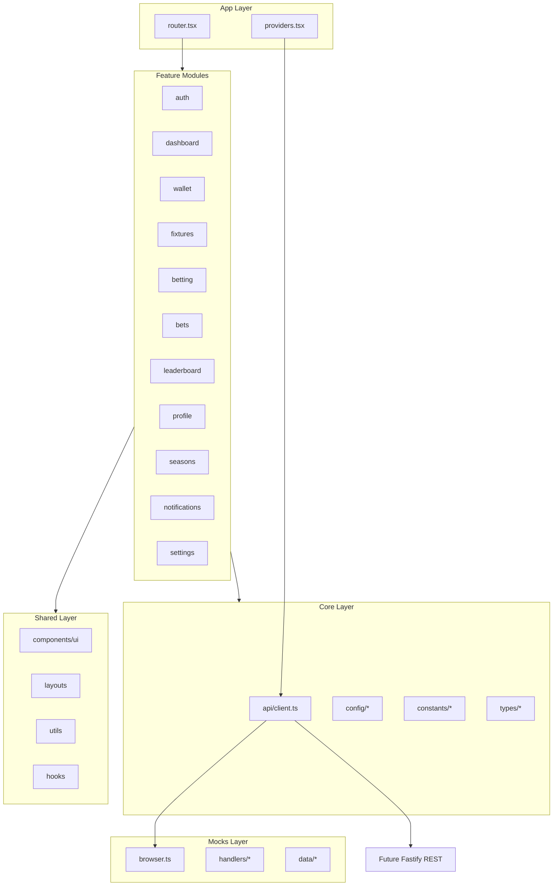
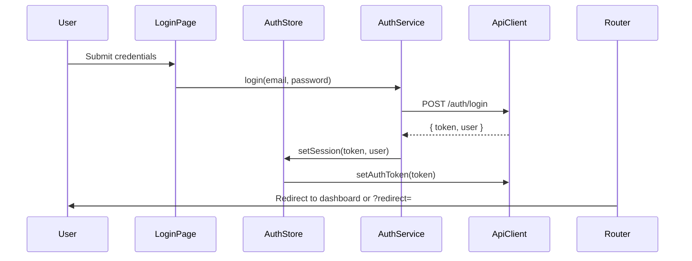

# Project Architecture — Sports Tipster Platform

> **Scope:** React 19 web frontend only (football MVP). Backend integration is contract-driven; no server code in this repository.

## 1. System Context

The Sports Tipster Platform is a **virtual sports betting competition**. Users register, receive virtual credits, place bets on football fixtures, and compete on a seasonal leaderboard. Top-ranked users win physical prizes managed offline by administrators.

This is **not** a real-money gambling product. The UI must communicate virtual stakes clearly while delivering a premium sports-app experience comparable to Flashscore, Sofascore, or DraftKings — with an original visual identity.

### 1.1 Actors

| Actor | Interaction |
|-------|-------------|
| **Registered user** | Auth, betting, wallet, leaderboard, profile |
| **Anonymous visitor** | Auth pages, Terms of Service only |
| **Future admin** | Out of scope (separate app or route group later) |
| **Future backend API** | REST + JWT; Socket.IO for live updates |

### 1.2 Technology Stack

| Layer | Choice | Role |
|-------|--------|------|
| UI | React 19 | Component rendering, concurrent features |
| Build | Vite 8 | Dev server, HMR, production bundling |
| Language | TypeScript (strict) | Type safety across features |
| Styling | Tailwind CSS 4 | Utility-first responsive design |
| Routing | React Router 7 | SPA navigation, guards, lazy routes |
| Server state | TanStack Query 5 | Caching, mutations, background refresh |
| Client state | Zustand 5 | Auth session, bet slip, UI preferences |
| HTTP | Axios | REST client with interceptors |
| Mocking | MSW 2 | Dev/test API interception |
| Forms | React Hook Form + Zod | Validation and error mapping |
| Motion | Framer Motion | Page transitions, drawers, modals |
| Charts | Recharts | Profile and performance visualizations |
| Icons | Heroicons v2 | Outline (nav) + solid (emphasis) |

### 1.3 Environment Configuration

Defined in `src/core/config/env.ts`:

| Variable | Default | Purpose |
|----------|---------|---------|
| `VITE_API_URL` | `http://localhost:3000/api` | REST base URL |
| `VITE_ENABLE_MSW` | `true` in dev | Enable Mock Service Worker |
| `import.meta.env.DEV` | — | Dev-only diagnostics |

---

## 2. Architectural Principles

1. **Feature-based modules** — Each domain (auth, fixtures, betting, etc.) is self-contained.
2. **Unidirectional data flow** — UI → hooks → services → Axios → API/MSW.
3. **Single source of truth for server data** — TanStack Query cache; no duplication in Zustand.
4. **Backend-ready contracts** — DTOs and REST paths defined before backend exists.
5. **Progressive enhancement** — Mobile-first layout; desktop gains sidebar and panels.
6. **Fail gracefully** — Typed errors, retry UI, route-level error boundaries.

---

## 3. Module Map



### 3.1 Feature Responsibilities

| Module | Primary pages | Key concerns |
|--------|---------------|--------------|
| **auth** | Login, Register, Forgot/Reset password | Session, JWT, guards |
| **dashboard** | Home (`/`) | Balance snapshot, rank, quick stats |
| **wallet** | `/wallet` | Credits, transaction history |
| **fixtures** | `/fixtures`, `/fixtures/:matchId` | Leagues, matches, odds display |
| **betting** | `/bet-slip` | Selections, stake, validation, place bet |
| **bets** | `/bets/active`, `/bets/history` | Lifecycle, cancellation penalty |
| **leaderboard** | `/leaderboard` | Rankings, search, filters |
| **profile** | `/players/:userId`, `/profile/edit` | Public transparency + self edit |
| **seasons** | `/seasons`, `/seasons/:seasonId` | Prizes, history |
| **notifications** | `/notifications` | In-app feed |
| **settings** | `/settings`, `/terms` | Preferences, static legal |

### 3.2 Core Layer (Cross-Cutting)

| Path | Responsibility |
|------|----------------|
| `core/api/client.ts` | Axios instance, auth header, error mapping |
| `core/config/bettingRules.ts` | Virtual balance rules (stake limits, penalties) |
| `core/config/env.ts` | Environment variables |
| `core/constants/routes.ts` | Canonical route paths and path builders |
| `core/constants/markets.ts` | Market types, match/bet/notification enums |
| `core/types/api.ts` | `ApiResponse`, `ApiError`, envelope types |

---

## 4. Data Flow

### 4.1 Read Path (Query)

```
Page Component
  → useFixturesQuery()           [features/fixtures/hooks]
    → fixturesService.list()     [features/fixtures/api]
      → apiClient.get('/fixtures')
        → MSW handler (dev) OR Fastify API (prod)
  → TanStack Query cache
  → UI renders with loading/error/empty states
```

### 4.2 Write Path (Mutation)

```
BetSlipForm
  → usePlaceBetMutation()
    → betsService.place(payload)
      → apiClient.post('/bets', payload)
    → onSuccess:
        - invalidate walletKeys, betKeys, fixtureKeys
        - toast success
        - clear bet slip selections (Zustand)
```

### 4.3 Client-Only State (Zustand)

```
Fixture odds click
  → betSlipStore.addSelection(selection)
  → BetSlipDrawer reads from store (no server round-trip)
  → On place bet, mutation sends aggregated payload to API
```

### 4.4 Authentication Flow



On app bootstrap:

1. `authStore.initialize()` reads token from `sessionStorage`.
2. If token exists, `useMeQuery()` validates session via `GET /auth/me`.
3. 401 response triggers logout and redirect to login.

---

## 5. Layout Architecture

| Layout | Used by | Structure |
|--------|---------|-----------|
| **MainLayout** | All protected app routes | Header + content + bottom nav (mobile) / sidebar (desktop) |
| **AuthLayout** | `/auth/*` | Centered card, branding, no main nav |
| **MinimalLayout** | `/terms`, 404 | Single column, no navigation chrome |

Responsive breakpoint: `lg` (1024px) switches bottom tabs to sidebar navigation.

---

## 6. Backend Integration Overview

The frontend defines the **API contract**. When the Node.js (Fastify) backend is implemented:

1. Set `VITE_ENABLE_MSW=false`.
2. Point `VITE_API_URL` to the deployed API.
3. Implement REST endpoints documented in `API_INTEGRATION_PLAN.md`.
4. Add `core/socket/` for Socket.IO (live odds, scores, notifications).
5. Migrate token storage from `sessionStorage` to httpOnly cookie + refresh token flow.

**No feature folder restructuring is required** — only env changes and optional auth interceptor updates.

### 6.1 Response Envelope

All REST responses follow the shape defined in `src/core/types/api.ts`:

```typescript
interface ApiResponse<T> {
  data: T
  meta?: { page?, limit?, total?, totalPages? }
}

interface ApiErrorBody {
  code: string
  message: string
  details?: Record<string, string[]>
}
```

### 6.2 Real-Time (Future)

| Event | Transport | UI impact |
|-------|-----------|-----------|
| Odds update | Socket.IO `odds:update` | Invalidate `fixtureKeys.detail(id)` |
| Match status | Socket.IO `match:status` | Update live badge |
| Bet settled | Socket.IO `bet:settled` | Invalidate bets + wallet |
| Rank change | Socket.IO `leaderboard:update` | Invalidate leaderboard |

Until Socket.IO ships, MSW + Query polling (30–60s on live fixtures) provides fallback UX.

---

## 7. Error Handling Strategy

| Layer | Mechanism |
|-------|-----------|
| Axios | Throws `ApiError` with `status`, `code`, `details` |
| Query | `QueryErrorFallback` with retry button |
| Route | React `ErrorBoundary` per layout segment |
| Form | Map `details` to React Hook Form field errors |
| Global | Toast for mutation failures; 401 → forced logout |

---

## 8. Security Considerations (Frontend)

- JWT stored in `sessionStorage` for MVP (document migration path to httpOnly cookies).
- No secrets in client bundle; only public env vars prefixed with `VITE_`.
- XSS mitigation: never render raw HTML from user content; sanitize avatar URLs.
- CSRF: not applicable for Bearer token MVP; required when switching to cookies.
- Route guards prevent unauthenticated access to betting and wallet surfaces.

---

## 9. Performance Strategy

- **Code splitting:** `React.lazy()` per feature page from Phase 11.
- **Query defaults:** `staleTime` tuned per domain (fixtures 30s live, leaderboard 60s).
- **List virtualization:** Consider for leaderboard 500+ rows (Phase 7+).
- **Images:** Lazy load team crests; WebP where available.
- **Motion:** Disable heavy animations on odds tables; respect `prefers-reduced-motion`.

---

## 10. Testing Strategy (Planned)

| Type | Tooling | Scope |
|------|---------|-------|
| Unit | Vitest | Utils, formatters, betting rule helpers |
| Component | Vitest + RTL | UI primitives, form validation |
| Integration | MSW + RTL | Auth flow, place bet flow |
| E2E | Playwright (optional) | Critical user journeys |

---

## 11. Related Documents

| Document | Focus |
|----------|-------|
| `FOLDER_STRUCTURE.md` | Directory tree and import rules |
| `ROUTING_PLAN.md` | Routes, guards, layouts |
| `STATE_MANAGEMENT_PLAN.md` | Zustand vs Query boundaries |
| `API_INTEGRATION_PLAN.md` | REST catalog, DTOs, MSW |
| `UI_DESIGN_SYSTEM.md` | Visual tokens and components |
| `COMPONENT_GUIDELINES.md` | Component tiers and patterns |
| `DEVELOPMENT_ROADMAP.md` | Phased implementation plan |
