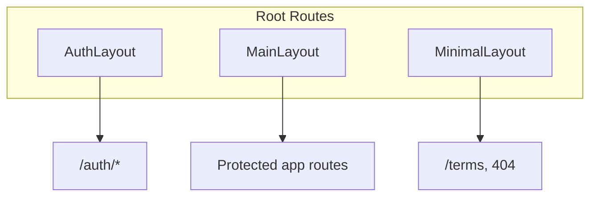

# Routing Plan — Sports Tipster Platform

> React Router v7 SPA routing with layout segments, auth guards, and lazy-loaded pages.

## 1. Route Constants

Canonical paths live in `src/core/constants/routes.ts`:

```typescript
export const ROUTES = {
  HOME: '/',
  LOGIN: '/auth/login',
  REGISTER: '/auth/register',
  FORGOT_PASSWORD: '/auth/forgot-password',
  RESET_PASSWORD: '/auth/reset-password',
  FIXTURES: '/fixtures',
  MATCH: '/fixtures/:matchId',
  BET_SLIP: '/bet-slip',
  BETS_ACTIVE: '/bets/active',
  BETS_HISTORY: '/bets/history',
  WALLET: '/wallet',
  LEADERBOARD: '/leaderboard',
  PLAYER: '/players/:userId',
  SEASONS: '/seasons',
  SEASON: '/seasons/:seasonId',
  NOTIFICATIONS: '/notifications',
  PROFILE_EDIT: '/profile/edit',
  SETTINGS: '/settings',
  TERMS: '/terms',
} as const
```

Path builders for type-safe navigation:

```typescript
matchPath(matchId: string)    // → /fixtures/{matchId}
playerPath(userId: string)    // → /players/{userId}
seasonPath(seasonId: string)  // → /seasons/{seasonId}
```

**Rule:** Always navigate using `ROUTES` or path builders — never hardcode path strings in components.

---

## 2. Full Route Table

| Path | Route name | Page component | Auth | Layout | Lazy | Notes |
|------|------------|----------------|------|--------|------|-------|
| `/auth/login` | login | `LoginPage` | Guest | AuthLayout | Phase 2 | Supports `?redirect=` |
| `/auth/register` | register | `RegisterPage` | Guest | AuthLayout | Phase 2 | Grants initial credits on success |
| `/auth/forgot-password` | forgot-password | `ForgotPasswordPage` | Guest | AuthLayout | Phase 2 | Email sent confirmation |
| `/auth/reset-password` | reset-password | `ResetPasswordPage` | Guest | AuthLayout | Phase 2 | Requires `?token=` query param |
| `/` | dashboard | `DashboardPage` | Protected | MainLayout | Phase 3 | Default post-login destination |
| `/fixtures` | fixtures | `FixturesPage` | Protected | MainLayout | Phase 4 | League filter via search params |
| `/fixtures/:matchId` | match-detail | `MatchDetailPage` | Protected | MainLayout | Phase 4 | All market types |
| `/bet-slip` | bet-slip | `BetSlipPage` | Protected | MainLayout | Phase 5 | Also available as drawer |
| `/bets/active` | bets-active | `ActiveBetsPage` | Protected | MainLayout | Phase 6 | Cancel flow |
| `/bets/history` | bets-history | `BetHistoryPage` | Protected | MainLayout | Phase 6 | Filters via search params |
| `/wallet` | wallet | `WalletPage` | Protected | MainLayout | Phase 3 | Transaction history |
| `/leaderboard` | leaderboard | `LeaderboardPage` | Protected | MainLayout | Phase 7 | Sort/filter via search params |
| `/players/:userId` | public-profile | `PublicProfilePage` | Protected | MainLayout | Phase 8 | Transparency profile |
| `/seasons` | seasons | `SeasonsPage` | Protected | MainLayout | Phase 9 | Current + past seasons |
| `/seasons/:seasonId` | season-detail | `SeasonDetailPage` | Protected | MainLayout | Phase 9 | Prizes, standings snapshot |
| `/notifications` | notifications | `NotificationsPage` | Protected | MainLayout | Phase 10 | Mark read actions |
| `/profile/edit` | profile-edit | `EditProfilePage` | Protected | MainLayout | Phase 10 | Own profile only |
| `/settings` | settings | `SettingsPage` | Protected | MainLayout | Phase 10 | Preferences |
| `/terms` | terms | `TermsPage` | Public | MinimalLayout | Phase 11 | Static legal content |
| `*` | not-found | `NotFoundPage` | Public | MinimalLayout | Phase 1 | 404 handler |

### 2.1 Auth Column Legend

| Value | Behavior |
|-------|----------|
| **Protected** | Requires valid session; redirect to `/auth/login?redirect={currentPath}` |
| **Guest** | Redirect to `/` if already authenticated |
| **Public** | Accessible regardless of auth state |

> **Note:** `/players/:userId` requires authentication to view other users' profiles in MVP. Unauthenticated users are redirected to login. The profile data itself is "public" among registered competitors.

---

## 3. Layout Architecture



### 3.1 MainLayout

**Used by:** All protected application routes.

**Structure (desktop `lg+`):**

```
┌─────────────────────────────────────────────┐
│ Header (balance, notifications, avatar)      │
├──────────┬──────────────────────────────────┤
│ Sidebar  │ PageShell → {Outlet}              │
│ Nav      │                                   │
└──────────┴──────────────────────────────────┘
```

**Structure (mobile `< lg`):**

```
┌─────────────────────────────────────────────┐
│ Header (compact)                              │
├─────────────────────────────────────────────┤
│ PageShell → {Outlet}                          │
├─────────────────────────────────────────────┤
│ BottomNav (5 tabs)                            │
└─────────────────────────────────────────────┘
```

**Shared elements:**

- Header shows virtual balance from wallet query
- Notification bell with unread count badge
- Avatar dropdown → Profile, Settings, Logout

### 3.2 AuthLayout

**Used by:** `/auth/login`, `/auth/register`, `/auth/forgot-password`, `/auth/reset-password`

- Centered card (max-width 420px)
- Brand logo + tagline
- No main navigation
- Link to `/terms` in footer

### 3.3 MinimalLayout

**Used by:** `/terms`, `*` (404)

- Single column, no navigation chrome
- Optional back link or logo header

---

## 4. Route Guards

### 4.1 ProtectedRoute

```typescript
// shared/guards/ProtectedRoute.tsx
function ProtectedRoute() {
  const isAuthenticated = useAuthStore((s) => s.isAuthenticated)
  const location = useLocation()

  if (!isAuthenticated) {
    return <Navigate to={`${ROUTES.LOGIN}?redirect=${encodeURIComponent(location.pathname)}`} replace />
  }

  return <Outlet />
}
```

**Initialization gate:** While `authStore.isInitializing`, render full-page skeleton instead of redirecting.

### 4.2 GuestRoute

```typescript
function GuestRoute() {
  const isAuthenticated = useAuthStore((s) => s.isAuthenticated)

  if (isAuthenticated) {
    return <Navigate to={ROUTES.HOME} replace />
  }

  return <Outlet />
}
```

### 4.3 Post-Login Redirect

After successful login:

1. Read `redirect` search param
2. Validate redirect is internal path (starts with `/`, no protocol)
3. Navigate to redirect or `ROUTES.HOME`

---

## 5. Router Configuration

```typescript
// app/router.tsx (conceptual structure)
const router = createBrowserRouter([
  {
    element: <GuestRoute />,
    children: [
      {
        element: <AuthLayout />,
        children: [
          { path: ROUTES.LOGIN, element: <LoginPage /> },
          { path: ROUTES.REGISTER, element: <RegisterPage /> },
          { path: ROUTES.FORGOT_PASSWORD, element: <ForgotPasswordPage /> },
          { path: ROUTES.RESET_PASSWORD, element: <ResetPasswordPage /> },
        ],
      },
    ],
  },
  {
    element: <ProtectedRoute />,
    children: [
      {
        element: <MainLayout />,
        children: [
          { path: ROUTES.HOME, element: <DashboardPage /> },
          { path: ROUTES.FIXTURES, element: <FixturesPage /> },
          { path: ROUTES.MATCH, element: <MatchDetailPage /> },
          // ... remaining protected routes
        ],
      },
    ],
  },
  {
    element: <MinimalLayout />,
    children: [
      { path: ROUTES.TERMS, element: <TermsPage /> },
      { path: '*', element: <NotFoundPage /> },
    ],
  },
])
```

---

## 6. Search Params Conventions

| Route | Param | Values | Purpose |
|-------|-------|--------|---------|
| `/auth/login` | `redirect` | internal path | Post-login navigation |
| `/auth/reset-password` | `token` | string | Password reset token |
| `/fixtures` | `league` | league ID | Filter by league |
| `/fixtures` | `status` | `live`, `scheduled`, `finished` | Filter by match status |
| `/bets/history` | `status` | bet status enum | Filter results |
| `/bets/history` | `from`, `to` | ISO date | Date range |
| `/leaderboard` | `sort` | `points`, `roi`, `form` | Sort metric |
| `/leaderboard` | `q` | string | Player search |

Use `useSearchParams()` with typed parsers in feature hooks.

---

## 7. Navigation Map

### 7.1 Primary Navigation (Bottom Nav / Sidebar)

| Label | Path | Icon |
|-------|------|------|
| Home | `/` | HomeIcon |
| Fixtures | `/fixtures` | CalendarIcon |
| Bet Slip | `/bet-slip` | TicketIcon (+ badge) |
| Leaderboard | `/leaderboard` | TrophyIcon |
| More | `/settings` menu | EllipsisIcon |

### 7.2 Secondary Navigation ("More" menu)

| Label | Path |
|-------|------|
| Active Bets | `/bets/active` |
| Bet History | `/bets/history` |
| Wallet | `/wallet` |
| Seasons | `/seasons` |
| Notifications | `/notifications` |
| Edit Profile | `/profile/edit` |
| Settings | `/settings` |

---

## 8. Deep Links & Cross-Feature Links

| From | To | Trigger |
|------|-----|---------|
| Dashboard quick stat | `/bets/active` | "Active bets" card click |
| Fixture list | `/fixtures/:matchId` | Match row click |
| Match detail | `/bet-slip` | "View bet slip" after selection |
| Leaderboard row | `/players/:userId` | Username/avatar click |
| Public profile | `/fixtures/:matchId` | Bet history row click |
| Header avatar | `/profile/edit` | Dropdown menu |
| Season card | `/seasons/:seasonId` | Season list item |
| Notification item | context-dependent | Bet → `/bets/active`, rank → `/leaderboard` |

---

## 9. Document Titles

Use `useDocumentTitle` hook in page components:

| Route | Title pattern |
|-------|---------------|
| `/` | `Dashboard · Sports Tipster` |
| `/fixtures/:matchId` | `{Home} vs {Away} · Fixtures` |
| `/players/:userId` | `{Username} · Profile` |
| `/leaderboard` | `Leaderboard · Sports Tipster` |

---

## 10. Error & Loading Boundaries

| Scope | Component |
|-------|-----------|
| Root | `ErrorBoundary` in `App.tsx` |
| MainLayout | `ErrorBoundary` wrapping `<Outlet />` |
| Each lazy page | Suspense fallback → page skeleton |

404 page includes links to `/` and `/fixtures`.

---

## 11. Lazy Loading Strategy (Phase 11)

```typescript
const FixturesPage = lazy(() => import('@/features/fixtures/pages/FixturesPage'))
```

Wrap route elements in `<Suspense fallback={<PageSkeleton />}>`.

**Prefetch:** On hover over nav items, `router.preload()` (React Router v7) for faster transitions.

---

## 12. Future Routes (Out of Scope)

| Path | Purpose |
|------|---------|
| `/admin/*` | Admin dashboard (separate app) |
| `/auth/verify-email` | Email verification |
| `/help` | Help center |

---

## 13. Related Documents

- `FOLDER_STRUCTURE.md` — Page file locations
- `STATE_MANAGEMENT_PLAN.md` — Auth store integration with guards
- `PROJECT_ARCHITECTURE.md` — Layout architecture diagrams
